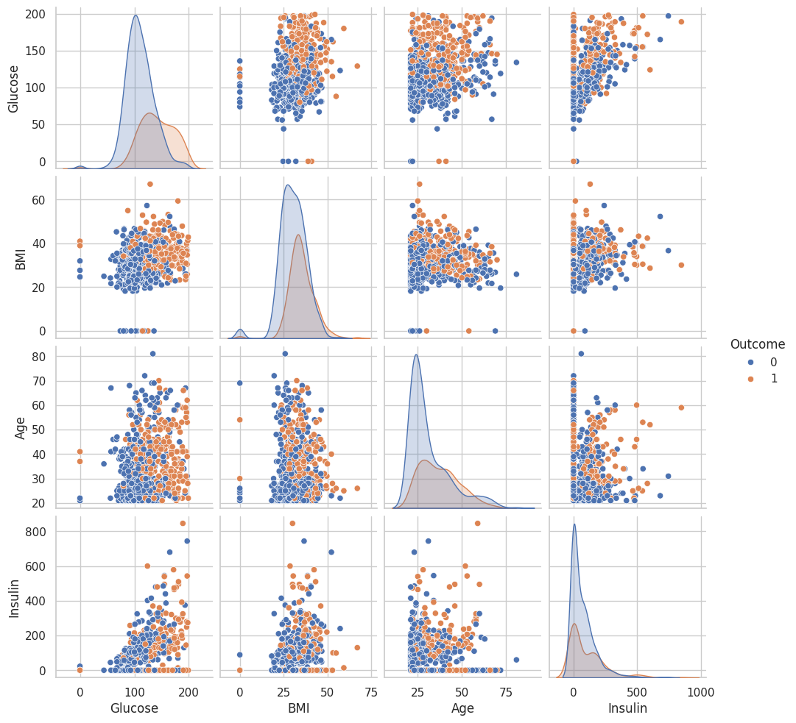
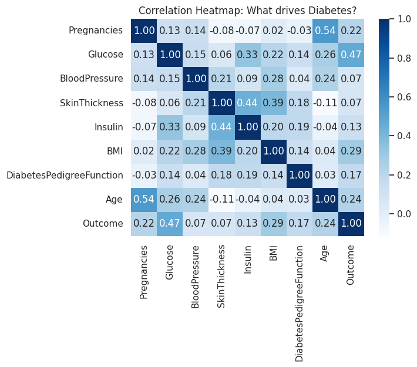

# 🩺 Diabetes Risk Prediction

A machine learning project that predicts whether a patient is at risk of diabetes using medical diagnostic measurements.

This project demonstrates a complete end-to-end data science workflow including data preprocessing, exploratory data analysis (EDA), model building, and performance evaluation.

---

## 📌 Project Objective

The goal of this project is to build a classification model that can predict diabetes risk based on health-related features such as glucose level, BMI, insulin, and age.

The focus areas include:
- Data cleaning and preprocessing
- Feature analysis and visualization
- Model training and evaluation
- Understanding healthcare classification problems

---

## 📂 Dataset Information

The dataset contains diagnostic medical measurements of female patients.

**Target Variable:**
- `Outcome`
  - 0 → Non-Diabetic
  - 1 → Diabetic

**Key Features:**
- Pregnancies
- Glucose
- BloodPressure
- SkinThickness
- Insulin
- BMI
- DiabetesPedigreeFunction
- Age

Dataset file location:
```
Dataset/diabetes.csv
```

---

## 📊 Exploratory Data Analysis

The following visual analyses were performed:

- Feature distribution analysis
- Correlation heatmap
- Pairplot of major features
- Glucose risk distribution comparison
- Model performance comparison

### 🔎 Feature Relationship (Pairplot)



### 🔥 Correlation Matrix



---

## 🤖 Model Development

Machine learning models were trained to classify diabetes risk.

**Algorithms Used:**
- Logistic Regression
- Random Forest Classifier

**Evaluation Metrics:**
- Accuracy Score
- Confusion Matrix
- Precision
- Recall
- F1-Score

---

## 📁 Repository Structure

```
diabetes-risk-prediction/
│
├── Dataset/
│   └── diabetes.csv
│
├── Images_Plots/
│   ├── EDA.png
│   ├── correlation_matrix.png
│   ├── feature_pairplot_diabetes.png
│   ├── glucose_risk_analysis.png
│   └── model_performance.png
│
├── Script/
│   └── diabietis_pred (2).ipynb
│
├── requirements
├── LICENSE
└── README.md
```

---

## 🚀 How to Run the Project

1. Clone the repository:
   ```bash
   git clone https://github.com/Gaurav-mali12/diabetes-risk-prediction
   ```

2. Navigate into the project directory:
   ```bash
   cd diabetes-risk-prediction
   ```

3. Install dependencies:
   ```bash
   pip install -r requirements.txt
   ```

4. Open the notebook:
   ```bash
   jupyter notebook
   ```

---

## 🔮 Future Improvements

- Hyperparameter tuning using GridSearchCV
- Cross-validation implementation
- Model deployment using Streamlit
- Improved feature engineering
- Handling class imbalance techniques

---

## 📜 License

This project is licensed under the MIT License.

You are free to use, modify, and distribute this project with proper attribution.

---

## 👨‍💻 Author

Gaurav Mali  
Aspiring Data Scientist | Python | SQL | Machine Learning

If you found this project useful, consider giving it a ⭐ on GitHub.
